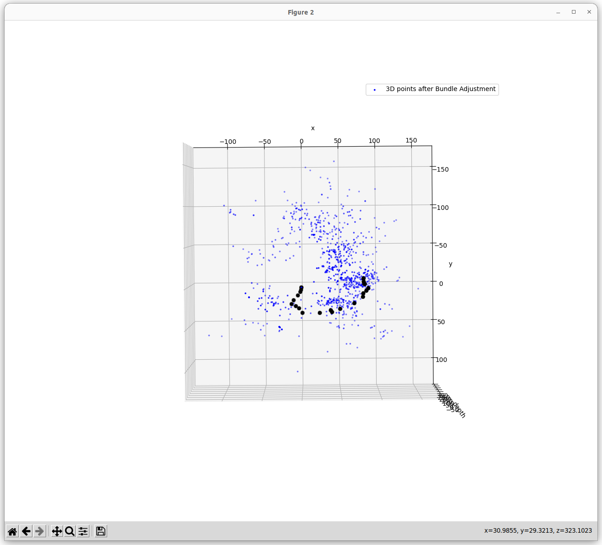
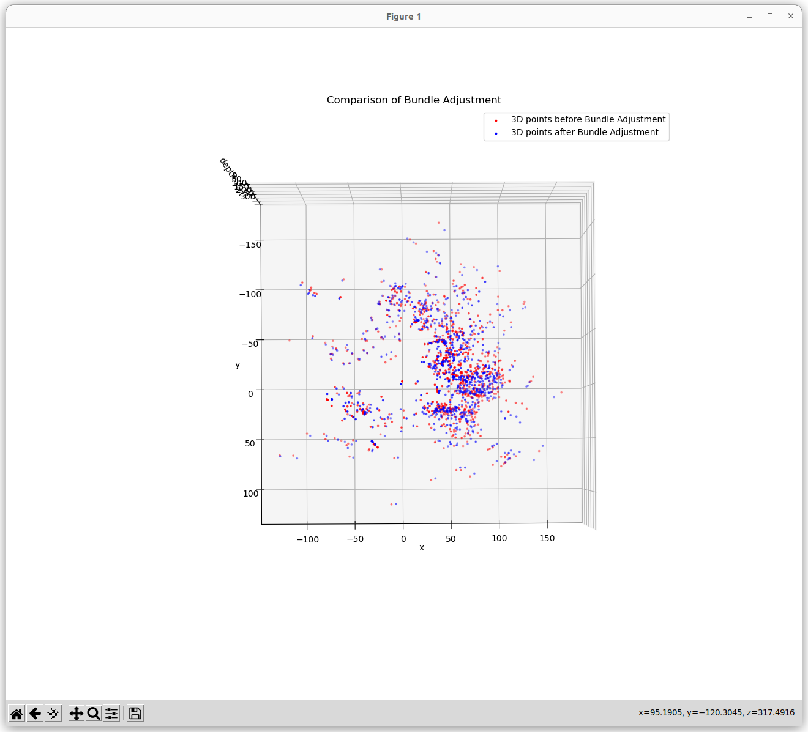
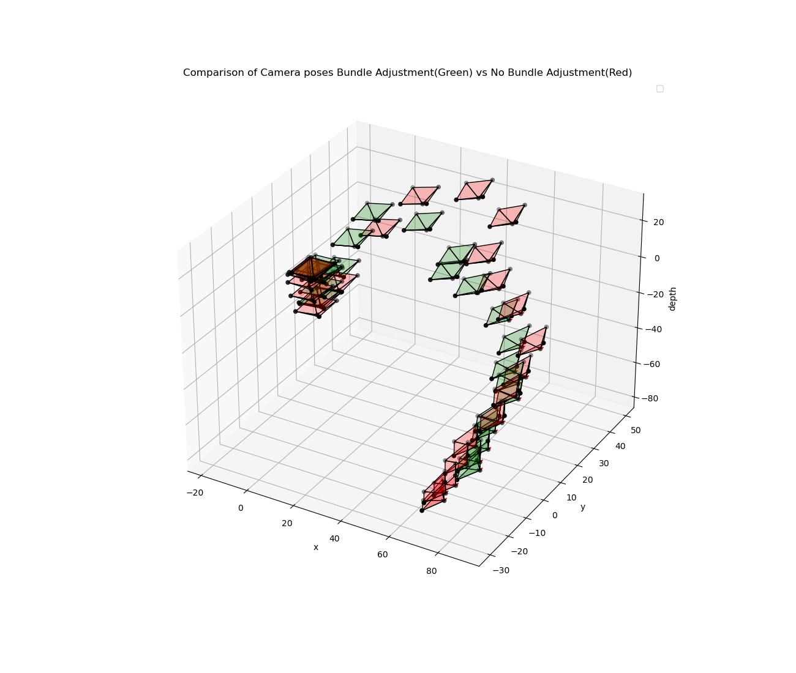

# Structure from Motion using Bundle Adjustment and graph optimization

My [previous implementaion](https://github.com/yashmewada9618/Structure-From-Motion-by-factorization) of SFM was using Optical Flow method and Cholesky Decomposition, but there are below mentioned problems with that approach:
1. Accumulation of errors.
    - Optical flow methods estimate motion locally on a per-pixel basis, and errors in pixel-level motion estimates can accumulate over time, leading to drift in the reconstructed 3D structure.
2. No Global Consistency:
    - Optical flow lacks global consistency across frames, making it challenging to ensure that the reconstructed 3D structure maintains accuracy and coherence over time.

Bundle Adjustment (BA) solves these errors and performs global optimization.

# A brief note on Bundle Adjustment.
BA is a non-linear method for solving the problem of simultaneously refining a set of initial camera and 3D scene parameters, so that the projected 3D points are as close as possible to the observed 2D points. The goal is to minimize the reprojection error. The reprojection error is the difference between the projected 3D points and the observed 2D points. The reprojection error is minimized using Levenberg-Marquardt algorithm. The reprojection error is given by:

```math
$$
\begin{equation}
    \epsilon = \sum_{i=1}^{N} \sum_{j=1}^{M} \left\| \mathbf{u}_{ij} - \pi \left( \mathbf{P}_i \mathbf{X}_j \right) \right\|^2
\end{equation}
$$
```
, where $\mathbf{u}_{ij}$ is the $j^{th}$ observed 2D point in the $i^{th}$ image, $\mathbf{P}_i$ is the camera matrix of the $i^{th}$ image and $\mathbf{X}_j$ is the $j^{th}$ 3D point. $\pi$ is the projection function which projects the 3D point to the image plane. The projection function is given by:
```math
$$
\begin{equation}
    \pi \left( \mathbf{P}_i \mathbf{X}_j \right) = \frac{1}{\mathbf{P}_{i_{3}} \mathbf{X}_{j_{3}}} \begin{bmatrix} \mathbf{P}_{i_{1}} \mathbf{X}_{j_{1}} \\ \mathbf{P}_{i_{2}} \mathbf{X}_{j_{2}} \end{bmatrix}
\end{equation}
$$
```
Now the measurement variable $\mathbf{z}$ is given by:
```math
$$
\begin{equation}
    \mathbf{z} = h \left( \mathbf{u}_{ij}, \mathbf{X}_j \right) 
\end{equation}
$$
```
, where $h$ is the measurement function which is given by:
```math
$$
\begin{equation}
    h \left( \mathbf{u}_{ij}, \mathbf{X}_j \right) = \mathbf{u}_{ij} - \pi \left( \mathbf{P}_i \mathbf{X}_j \right)
\end{equation}
$$
```
Furthermore, the Jacobian of the measurement function is given by:
```math
$$
\begin{equation}
    \mathbf{H} = \frac{\partial h}{\partial \mathbf{X}_j} = \begin{bmatrix} \frac{\partial h_1}{\partial \mathbf{X}_{j_{1}}} & \frac{\partial h_1}{\partial \mathbf{X}_{j_{2}}} & \frac{\partial h_1}{\partial \mathbf{X}_{j_{3}}} \\ \frac{\partial h_2}{\partial \mathbf{X}_{j_{1}}} & \frac{\partial h_2}{\partial \mathbf{X}_{j_{2}}} & \frac{\partial h_2}{\partial \mathbf{X}_{j_{3}}} \end{bmatrix}
\end{equation}
$$
```
The error function is given by:
```math
$$
\begin{equation}
    \mathbf{e} = \mathbf{z} - h \left( \mathbf{u}_{ij}, \mathbf{X}_j \right)
\end{equation}
$$
```
The main idea is to minimize this error function which is a non-linear function. We can use any other non-linear optimization methods like Guass-Newton, Levenberg-Marquardt, etc. I have used Levenberg-Marquardt algorithm provided by the GTSAM library. For this specific problem there are two Jacobians formed, which are nothing but the partial derivatives of the poses and landmarks. The Jacobian of the poses is given by:
```math
$$
\begin{equation}
    \frac{\partial \mathbf{e}}{\partial \mathbf{P}_i} = \frac{\partial \mathbf{e}}{\partial \mathbf{z}} \frac{\partial \mathbf{z}}{\partial \mathbf{P}_i} = - \frac{\partial \mathbf{e}}{\partial \mathbf{z}} \frac{\partial h}{\partial \mathbf{P}_i}
\end{equation}
$$
```
The Jacobian of the landmarks is given by:
```math
$$
\begin{equation}
    \frac{\partial \mathbf{e}}{\partial \mathbf{X}_j} = \frac{\partial \mathbf{e}}{\partial \mathbf{z}} \frac{\partial \mathbf{z}}{\partial \mathbf{X}_j} = - \frac{\partial \mathbf{e}}{\partial \mathbf{z}} \frac{\partial h}{\partial \mathbf{X}_j}
\end{equation}
$$
```
We combine the Jacobians of the poses and landmarks to form the Hessian Matrix used in either Guass-Newton or Levenberg-Marquardt algorithm. The Hessian Matrix is given by:
```math
$$
\begin{equation}
    \mathbf{H} = \mathbf{J}^T \mathbf{J}
\end{equation}
$$
```
, where $\mathbf{J}$ is the Jacobian matrix. The Jacobian matrix is given by:

```math
$$
\begin{equation}
    \mathbf{J} = \begin{bmatrix} \frac{\partial \mathbf{e}}{\partial \mathbf{P}_1} & \frac{\partial \mathbf{e}}{\partial \mathbf{P}_2} & \cdots & \frac{\partial \mathbf{e}}{\partial \mathbf{P}_N} & \frac{\partial \mathbf{e}}{\partial \mathbf{X}_1} & \frac{\partial \mathbf{e}}{\partial \mathbf{X}_2} & \cdots & \frac{\partial \mathbf{e}}{\partial \mathbf{X}_M} \end{bmatrix}
\end{equation}
$$
```

Dealing with this Hessian matrix is computationally expensive, as even for small number of poses this matrix can get dense. So we use the Schur Complement to reduce the size of the Hessian matrix or basically make it sparse in a way without loosing any information. 

Read more about Bundle Adjustment [here](https://www.cs.cmu.edu/~kaess/vslam_cvpr14/media/VSLAM-Tutorial-CVPR14-A13-BundleAdjustment.pdf).

This repo contains the code for the above mentioned title. As it was difficult to write and visualise the results in `.ipynb` file, the complete working code is written in the [main.py](https://gitlab.com/mewada.y/eece7150/-/blob/main/HW5/Scripts/main.py?ref_type=heads) file. Below is the output I got using bundle adjustment. The 3D structure somewhat resembles that of Buddha. The optimizer tried to minimize the reprojection error upto 420 pixels which is still more as the 3D points are scaled. 


# Output




# How 3D points are obtained in this code?
So the steps follwed for creating the 3D points are as follows:
1. For first pair of images the 3D point cloud is initialised.
    - The keypoints are obtained using SIFT with `nfeatures=5000` and `nOctaveLayers=3`.
    - The matches are obtained using `cv2.FlannBasedMatcher()`.
    - The matches are filtered using `cv2.RANSAC` and `cv2.findEssentialMat()`.
    - The camera pose is obtained using `cv2.recoverPose()`.
    - The 3D points are obtained using `cv2.triangulatePoints()`.
    - A dictionary and a class object for 3d points had been maintained throughout the code, where for every 3D point its corresponding 2D points in which it is visible is stored.
2. For the next pair of images, the 3D points are obtained as follows:
    - The keypoints are obtained using SIFT with `nfeatures=5000` and `nOctaveLayers=3`.
    - The matches are obtained using `cv2.FlannBasedMatcher()`.
    - The matches are filtered using `cv2.RANSAC`.
    - Then an exhaustive search is performed to find if the filtered keypoints where previously in the dictionary or not, if not then it is added to the    dictionary. If it was in the dictionary then its corresponding 3D point and its index is obtained.
    - The new keypoints are again filtered based on the found matched points from the dictionary.
    - Those points are used to obtain the relative Camera poses and this time `cv2.solvePnPRansac()`
    - For the obtained rotation and translation, the 3D points are triangulated using `cv2.triangulatePoints()`.
    - The new 3D points are added to the dictionary and the corresponding 2D points are added to the class object, after checking if the 3D point is already in the dictionary or not.
3. The above steps are repeated for all the pairs of images. And finally Bundle Adjustment is performed using `gtsam` library.

The graph optimization was able to reduce the pixel reprojection error from 1400 to 600 pixels, which is still more. The reason for this is that the 3D points are scaled. The 3D points are scaled because the camera poses are obtained using `cv2.solvePnPRansac()` which gives the camera pose upto a scale factor. So the 3D points are scaled. The graph optimization tries to minimize the reprojection error by adjusting the camera poses and the 3D points. But as the 3D points are scaled, the optimizer is not able to reduce the reprojection error below 600 pixels.